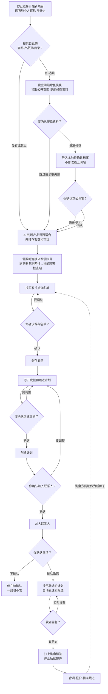

# 来发信：让 AI 帮你找海外买家、写开发信、自动跟进

    

> **安装完成后，先告诉 AI 你想做什么。** 只有你选择“开始新的获客项目”，才需要提供纯个人昵称和卖什么；卖给谁、卖到哪、自己的官网仍是选填。AI 会帮你提炼信息、推荐客群和市场、检查名单、写开发信并排好跟进；收到询盘后，你再接手报价和成交。

本仓库是给 AI 使用的免费操作说明书和工具箱，需要配合 [来发信平台](https://laifa.xin) 使用。它能减少重复劳动，但不保证询盘或订单，也不会未经你确认就激活发信。

## 快速入口

| 你现在想做什么 | 从这里进入 |
|---|---|
| 🌟🌟 **第一次使用** | [复制一段话给 AI，马上开始](#quickstart) |
| 🗺️ **先看新项目怎么工作** | [一张图看懂获客流程](#how-it-works) |
| 🎯 **先判断产品是否适合** | [查看适合与不适合的产品](#fit) |
| 🔄 **已经在使用** | [更新系统](#update) · [换电脑继续](#migrate) |

---

<a id="quickstart"></a>
## 🌟🌟 现在开始：把这段话发给 AI

请使用**能在你的电脑上打开文件、运行命令的 AI 助手**（不是只能聊天的普通 AI），例如 ZCode、Claude Code 或 Codex。把下面整段原样发给它，不需要提前填写产品资料：

```text
请帮我安装并学习这套来发信外贸获客 Skill：
https://github.com/tony-apan/laifaxin-b2b-sales

请按下面顺序执行：

1. 下载最新版代码。如果本机已经安装，先识别现有安装方式和本地数据，
   按仓库里的更新规则升级；不能覆盖或删除已有的 .local/ 和 runs/ 数据。

2. 自动检查并准备运行环境。
   不要假设电脑已经安装 Python、Git、curl 或其他依赖；
   严格按照仓库里的环境准备说明自动安装并复查。

3. 通读 README.md、SKILL.md、RULES.md 和相关 specs，
   将本仓库的 SKILL.md 作为后续执行入口，学会完整流程、确认节点、
   安全边界、网站资料增强和换机续接规则。不要创建另一份重复规则。

4. 运行仓库自检工具；发现问题先修复并重新检查。
   未通过自检，不要开始找客户、保存联系人、创建序列或发信。

5. 安装和学习完成后，用通俗中文告诉我：
   - 安装目录和当前版本
   - 环境与自检是否通过
   - 这套 Skill 能做什么
   - 哪些操作必须由我确认
   - 是否发现可以继续的旧项目

6. 最后只问我：“安装完成。你现在想做什么？”
   不要在安装阶段索取产品、市场、官网、昵称、token 或其他业务资料。
   等我说明想做什么后，再按 SKILL.md 渐进引导。
```

**发完就等 AI 安装和学习。** 你不需要先学 Git、Python、token，也不用自己敲命令。

安装完成后，AI 会先让你选择下一步：

1. 开始一个新的获客项目；
2. 判断产品是否适合批量冷邮件；
3. 从自己的官网、产品页或目录提炼资料；
4. 继续以前没有完成的项目；
5. 更新系统或换电脑继续；
6. 先了解完整流程。

只有你选择具体任务后，AI 才会询问该任务真正需要的信息。

<details>
<summary><b>AI 无法打开 GitHub 或下载失败？点开看备用办法</b></summary>

打开 [GitHub 仓库](https://github.com/tony-apan/laifaxin-b2b-sales) → 点击右上角 **Code → Download ZIP** → 解压。然后把解压后的文件夹路径发给 AI，再发送上面的指令。

如果电脑没有 Python、Git 或其他环境，不要自己排查；让 AI 按 `specs/environment-setup.md` 运行 `tools/bootstrap.sh --install`（macOS/Linux）或 `tools/bootstrap.ps1 -Install`（Windows）。

</details>

<a id="how-it-works"></a>
## 🗺️ 选择“开始新项目”后，获客流程怎么走



一句话：**AI 负责找、筛、写、排；你负责确认和接住询盘。**

- 只读查询和分析可以自动进行；所有会改动来发信账号的关键动作必须先得到你的确认。
- 激活前一封也不发；你明确说“确认激活”后，系统才按已经确认的计划自动发送，不是每封邮件都再问一次。
- 系统不会自动识别回复。发现买家回复后，人或 AI 必须实际打上“询盘”标签，后续邮件才会停止。
- 询盘只是信号，不等于订单；后续背调、报价、样品、谈判和成交仍由业务员负责。

AI 会按顺序了解你的信息：开局只问你的纯个人昵称和卖什么；**卖给谁、卖到哪、自己的官网/产品页/目录全部选填**。没填客群或市场时，AI 先给带理由的推荐，不追问阻断，也不把推荐冒充成你的原话。

如果你提供自己的网址，AI 可调用独立的[网站资料增强模块](specs/website-profile-sop.md)读取公开页面，把网站事实、企业自述、AI 分析和优化建议分开给你确认。未确认的资料不会进入正式档案；网站打不开、你跳过或模块失败，原流程照常继续。这个模块只优化本地档案、客群和开发信素材，**不会自动修改线上网站**。

之后 AI 再按需询问公司和产品补充资料（卖点、认证、产能、最低起订量、交期等）；都可以跳过，不会在开局让你填一张长表。邮件末尾签名区永远只有纯个人昵称；经你确认且有来源的产品事实，才可用于正文卖点。

<details>
<summary><b>执行细节：名单怎么筛、邮件怎么写、资料存哪里</b></summary>

- AI 会抽查公司资料，判断是否符合目标买家画像；内部 70% 是名单筛选边界，不是客户购买概率或质量保证。
- 默认每家公司最多保存 3 个联系人，特殊情况才提高到 6 或 9 个。
- 邮件计划共 12 轮，每轮准备 10 个表达变体；这是 **120 个模板**，不是给每个联系人发送 120 封邮件。每个联系人最多进入 12 次发送尝试，回复、退信、拒收或打标签后应停止。
- 公司资料保存在 `.local/operators/`，产品档案保存在对应 `runs/` 项目目录，换产品和换电脑时可复用。完整规则见 `specs/operator-profile-sop.md`、`specs/product-profile-sop.md` 和 `specs/sequence-config.md`。

</details>

<a id="fit"></a>
## 🎯 你的产品适合吗？

这套方法适合先建立客户基数、批量验证市场，再从回复中筛出值得精确跟进的买家。

| 产品形状 | 举例与原因 |
|---|---|
| ✅ **更适合**：买家多、决策快、有批发商、分销商或集成商 | 保温杯、户外用品、宠物用品、标准工业组件等；市场里能成批找到同类买家，也常用邮件询价 |
| ⚠️ **有条件适合**：买家数量尚可，但采购周期较长或需要资质 | 先缩小市场和客群，降低验证规模，不能只看 48 小时结果 |
| ❌ **不太适合**：大宗原料、长周期项目设备、必须招标/认证/入围、全市场买家很少 | 回询盘可能以月或年计；批量邮件只能辅助摸底，不能替代展会、渠道和关键客户开发 |

判断口诀：**能成批找到多少家买家？他们多久采购一次？采购人会不会用邮件回复？** AI 开跑前会按“强适配 / 条件适配 / 弱适配”说明理由，不合适也会直说。详细标准见 [specs/product-fit.md](specs/product-fit.md)。

## ⚖️ 发信前必须知道的边界

- 平台提供发送通道和基础设施，不代表运营方自动合规。激活前必须核对目标市场规则、名单来源、发送主体、退订入口、拒收名单和数据处理要求。
- 系统默认排除中国大陆、香港、澳门和台湾的联系人；其他国家和受管制行业仍需按实际业务单独检查。
- token 等同账号钥匙，只能直接粘贴到你信任、正在本机操作的主 AI 聊天框；不发群聊、子代理、工单或公开网页。仓库工具不会主动回显或落盘原始凭据，也不写 `.env`/日志；仅在凭据失效时于本机 `.local/` 保存不可还原的短哈希和重试次数。聊天服务是否保存对话取决于你所用 AI 的隐私与数据保留政策。
- 本地 `.local/` 和 `runs/<你的名字>/` 可能包含账号活动和运营资料；公开分享只使用 GitHub 仓库或 Release，不要打包整个工作目录。

<a id="validation"></a>
## 💰 投入前先算账：先免费试，再决定是否扩量

**本仓库工具和说明免费。** 来发信平台的套餐、点数，以及你后续的人工、样品、报价、合规等业务成本另计。

作者当前了解到的方式是：可联系来发信客服申请 **15 天 SVIP 免费体验**；觉得有价值再考虑付费。活动资格、套餐价格、赠点和扣点规则可能调整，请以 [来发信官网](https://laifa.xin) 当时客服确认结果为准，本仓库不替平台承诺权益。

<details>
<summary><b>点开查看：当前参考费用、1 万联系人验证法和止损线</b></summary>

> 以下是本项目截至 **2026-09-07** 使用的参考口径，不是行业通用基准。平台价格和权益以实时信息为准；验证阈值用于早期决策，不代表订单概率。

| 阶段 | 当前参考做法 |
|---|---|
| 0️⃣ **免费了解** | 联系来发信客服确认能否领取 15 天 SVIP，先完成账号连接、产品适配、名单抽查、模板和序列准备；免费额度不等于一定能跑完 1 万联系人 |
| 1️⃣ **准备扩量** | 当前参考套餐为 399 元/年 SVIP、赠点约 2.3 万；是否仍有效、赠点期限和具体扣点规则必须购买前向平台确认 |
| 2️⃣ **一轮验证** | 过往经验按约 1 万联系人估算；12 轮是每个联系人最多 12 次发送尝试，全部未回复且未停发时理论上限约 12 万次，默认排程约 10 个月，实际会因回复、退信、拒收、标签和发送限制减少 |
| 3️⃣ **看早期信号** | 首轮邮件实际发出后先看送达/退信，再在 48 小时统计有效询盘；自动回复、求职、推销、无关回复、同行套价不计入 |

本项目采用的内部止损线：

- **有效询盘 ≥3 个**：说明早期信号合格，可把询盘方网址作为新种子，继续找相似买家并逐步扩量；
- **有效询盘 <3 个**：先查送达、打开、回复和客群匹配，换客群或切入角度再试一轮；
- **连续两轮不达标**：停止这个批量项目，避免继续消耗。它只判断首轮早期信号，不能证明产品长期一定没有市场。

</details>

## 常见问题

- **会未经我同意就发信吗？** 不会。保存、建序列、添加联系人、激活都有确认闸门；你不明确说“确认激活”，就不会开始发送。
- **发了就能成单吗？** 不能保证。这套系统负责批量找买家和筛询盘，成单仍依赖背调、报价、样品、谈判和持续跟进。
- **我需要懂代码吗？** 不需要。把“现在开始”里的话发给能操作电脑的 AI，剩下让它照仓库规则执行。
- **一定要付费吗？** 仓库免费；来发信平台套餐和点数可能收费。先向平台客服确认当前试用和权益，再决定是否投入。
- **哪些行业需要额外检查？** 医疗器械、金融、酒类、烟草、儿童产品、受制裁或受管制品类，开始前必须核对目标市场、平台和行业规则。

<details>
<summary><b>📚 规则和文件在哪里？</b></summary>

| 文件 | 用途 |
|---|---|
| [RULES.md](RULES.md) | 规则唯一真源：状态、确认闸门和安全红线 |
| [SKILL.md](SKILL.md) | AI 执行入口和流程路由 |
| [specs/](specs/) | 环境、迁移、产品档案、接口、筛选、邮件序列等细则 |
| [methodology/](methodology/) | 决策树、最佳实践和检查清单 |
| [docs/](docs/) | 面向人的完整教程和成本方法 |
| [output-templates/](output-templates/) | AI 每一步向用户展示和确认的话术模板 |

README 只负责带你入门；执行时以 `RULES.md` 和对应 `specs/` 为准。

</details>

<details>
<summary><b>🔧 给技术朋友：运行环境、目录和实现边界</b></summary>

### 运行环境

| 项 | 说明 |
|---|---|
| 主流程依赖 | Python 3 标准库 + curl + bash；无需安装 Python 第三方包 |
| macOS / Linux | `bash tools/bootstrap.sh --install`，再运行 `python3 tools/onboard_check.py` |
| Windows | `powershell -NoProfile -ExecutionPolicy Bypass -File tools/bootstrap.ps1 -Install`；之后优先用脚本返回的 `python_cmd` 自检 |
| Windows 实机状态 | `bootstrap.ps1` 已通过静态检查，尚未在全新 Windows 实机完整验证；失败时按 `specs/environment-setup.md` 的官方安装路径兜底 |

### 目录与实现边界

- `RULES.md` 是规则唯一真源；`SKILL.md` 是 AI 入口；`specs/` 是接口和流程细则；`tools/` 是可执行工具。
- 审批闸门用于防误操作，不用于对抗主动篡改。S12 激活凭证只能由当前终端交互签发。
- 公开仓库不含真实租户 ID、联系人邮箱、标签/序列/模板 ID、审批编号和内部运营数据。
- `sequence-active` 早期曾返回 500；激活统一走 `tools/activate_sequence.py` 并回读状态确认。

</details>

<a id="old-users"></a>
## 🔄 老用户

<a id="update"></a>
### 更新到最新版（保留本地数据）

最快的说法：

> 帮我把来发信获客系统更新到最新版，保留我的本地数据；更新前先备份，完成后自检并告诉我版本变化。

<details>
<summary><b>点开复制完整更新指令（推荐）</b></summary>

```text
请帮我把这套外贸获客系统更新到最新版，保留我本地所有数据。

第 1 步｜判断我的安装方式（你自己判断，判断不出再问我）：
· 系统文件夹里有 .git → 按 git 方式更新；没有 .git → 按 ZIP 方式更新。

第 2 步｜找到原系统文件夹：
· 如果我已经提供路径，就用那个路径；找不到就问我，不要猜。

第 3 步｜更新前先备份本地数据：
· 把 .local/ 和 runs/ 下我自己的运营目录复制到系统文件夹外；
· 核对备份前后的文件数量，更新成功且数据完好后才可删除备份。

第 4 步｜按安装方式更新：
· git：在原系统文件夹执行 git pull；如果有本地修改或冲突，不要强推或删除，停下告诉我。
· ZIP：下载 https://github.com/tony-apan/laifaxin-b2b-sales/releases/latest 的 ZIP，
  把新版文件覆盖进原系统文件夹。绝不能解压成新文件夹让我改用新的，否则会丢失本地状态。

第 5 步｜ZIP 更新后检查残留：
· 新版不存在的旧文件先列出来问我，未经确认不要删除。

第 6 步｜复查并汇报：
· 按 specs/environment-setup.md 运行 check-only；缺失项先修复。
· 用 bootstrap 返回的 python_cmd 运行 tools/onboard_check.py。
· 告诉我更新后的版本和主要变化；确认 .local/ 与 runs/ 对照备份仍完整。
```

</details>

<a id="migrate"></a>
### 换电脑继续干

> 换电脑不是从头再跑。旧电脑只迁移本地状态和运营档案；token 不迁移，在新电脑重新获取。旧审批记录只保留审计用途，不能直接授权新电脑写操作。

<details>
<summary><b>💻 旧电脑：点开复制备份指令</b></summary>

```text
请帮我为“来发信 B2B 获客系统”做换机备份：
1. 找到当前系统文件夹并阅读 specs/migration-handoff.md；找不到就问我，不要猜。
2. 只备份 .local/、runs/ 下我自己的运营目录，以及 db/ 中本地新增的数据表。
3. 排除 runs/_template、runs/INDEX.md、db/docs.tsv、db/tools.tsv、token、浏览器缓存、系统钥匙串和仓库规则文件。
4. 把备份包放到系统文件夹外，核对源文件与包内文件数量和大小；不要上传到公开仓库。
5. 告诉我备份路径、包含内容、可续接项目和当前状态；不要改动原项目。
```

</details>

<details>
<summary><b>🖥️ 新电脑：点开复制恢复和续接指令</b></summary>

```text
请按 specs/migration-handoff.md 接手这套来发信获客系统，不要从 S0 重跑已有项目：
1. 阅读 README.md、SKILL.md、RULES.md、specs/environment-setup.md 和 specs/migration-handoff.md。
2. 自动准备环境；安装后再跑 check-only，全部通过才继续。
3. 找到旧电脑备份，先解到临时目录列出内容；确认后只按白名单恢复：
   .local/、runs/<运营方>/（不碰 runs/_template 和 runs/INDEX.md）、db/ 中本地新增的数据表
   （不覆盖 db/docs.tsv、db/tools.tsv 等已跟踪文件）。
   不覆盖 README/RULES/SKILL/specs/tools；git 安装用 git status 检查，ZIP 安装与新下载包清单/hash 对比。
4. 用 bootstrap 返回的 python_cmd 运行 tools/onboard_check.py，列出可续接项目、operation-record 状态和 product-profile 版本/确认状态/更新时间。
5. 让我选择项目；读取运营方档案和该项目的 operation-record/product-profile/reflection/evidence/verify-*，报告当前节点、已完成、未完成和下一步。
6. token 不从旧机迁移；在新电脑重新获取，再运行 check_login.py 和 gate_check.sh。
7. 恢复后立即运行 approval.py demote-migrated --confirm MIGRATION-DEMOTE，把旧 confirmed 凭证降为 backfilled（只审计、不可授权）；未执行的写操作和 S12 在当前对话重新确认。
8. 只从记录的当前节点继续；禁止重复建档、保存、建模板或序列。记录不一致就进入 ERROR_BLOCKED，只读核对后再处理。
9. 汇报环境、恢复目录、项目状态、profile 版本/hash、token 复验结果、下一步和仍需我确认的动作。
```

</details>

详细迁移标准见 [specs/migration-handoff.md](specs/migration-handoff.md)。

---

## 📮 联系与反馈


使用中卡住，可以扫码联系作者，也可以提交 [GitHub Issue](https://github.com/tony-apan/laifaxin-b2b-sales/issues)。平台试用、套餐和点数权益请以 [来发信官网](https://laifa.xin) 客服的实时答复为准。

许可证：[GPL-3.0](LICENSE) · [更新记录](CHANGELOG.md) · [最新版 Release](https://github.com/tony-apan/laifaxin-b2b-sales/releases/latest)
