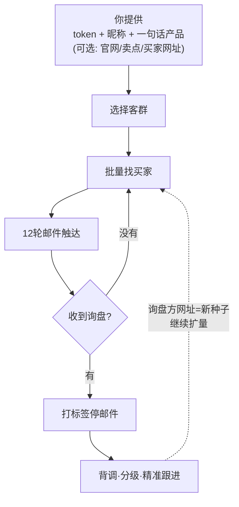

# 来发信 B2B 批量获客系统

    

> **批量触达相关买家，低成本筛出询盘；收到询盘后，再由业务员背调和精准跟进。**

这是一个给 AI 使用的操作说明书和工具箱。它不是自动成交工具，也不是逐家公司手工定制的精准开发服务。

**适合你，如果你：**

- 缺少客户基数，想先批量验证一个市场；
- 不想把大量人工时间花在没有回复的陌生公司上；
- 有能力承接询盘后的背调、报价、样品、谈判和长期跟进。



> **询盘只是信号，不等于订单。** 系统不会自动识别回复或自动打标签；人或 AI 助手发现回复后，必须实际打上“询盘”标签，邮件序列才会停止后续轮次。**优质询盘方的网址还是最好的新种子**——回流继续扩量，越滚越准。

| 快速入口 | |
|---|---|
| 🚀 [快速开始](#-第一步现在就把代码拿到手) | 下载仓库 → 准备 4 样 → 交给 AI |
| 📖 [完整方法：广撒网 + 精准跟进](docs/09-mass-outreach-to-precision-follow-up.md) | 成本账 / 询盘背调 / 分级 / 多渠道 |
| 📦 [最新版下载与版本说明](https://github.com/tony-apan/laifaxin-b2b-sales/releases/latest) | Releases |
| 🔄 [更新到新版本](#-更新到新版本老用户) | 老用户升级（保留本地数据）|

---

## 📦 第一步：现在就把代码拿到手

"代码"＝给电脑下的指令，这套系统就是写好的指令集合。**你不用碰命令行——把下面整段复制给 AI 就行。**

**办法 A（最简单）：把下面整段复制发给 AI**

```text
请帮我把这套外贸获客系统安装到我的电脑并完成学习：

1. 下载代码库（若我已发你本地文件夹/ZIP 路径，跳过这步，直接用那个文件夹）：
   git clone https://github.com/tony-apan/laifaxin-b2b-sales.git
   （如果 git 不可用，直接下载 https://github.com/tony-apan/laifaxin-b2b-sales/archive/refs/heads/master.zip 并解压）

2. 通读仓库，重点按顺序学习：
   ① README.md（产品定位与流程）
   ② SKILL.md（你的执行入口：渐进引导图/路由表/状态机/铁律/话术模板索引）
   ③ RULES.md（唯一真源：完整状态机与铁律）
   ④ output-templates/README.md（对用户展示的话术模板总索引——之后每一步对用户说什么都照模板）
   ⑤ specs/ 与 methodology/（细节规范，执行到对应节点时精读）

3. 学完后向我汇报（用通俗中文；token 现在不用催，到时带我去拿）：
   · 这套系统是干什么的、我的角色是什么
   · 你需要我提供什么（听说只要 token 和昵称+一句话产品，确认一下）
   · 整个流程分几步、哪些步骤会找我确认
   · 有什么风险或注意事项

4. 汇报完等我的产品介绍，然后按 SKILL.md 带我走完整个获客流程。
   注意：系统默认不发信；每一步都要我确认；最终激活发信必须我明确说"确认激活"。
```

**办法 B：点两下鼠标（不用 AI 代劳）**

在浏览器打开 https://github.com/tony-apan/laifaxin-b2b-sales（存代码的公开网站，用法和网盘差不多）→ 点网页**右上角 Code → Download ZIP**（ZIP＝压缩包，就是一个打包好的文件）→ 解压到桌面，然后把解压后的文件夹路径连同上面那段话一起发给 AI。

## 第二步：准备 4 样东西

- **① 一个来发信账号**。来发信（web.laifaxin.com）是帮你发邮箱、管跟进计划的平台，注册一个就行；账号的"钥匙"（token，一串字符）先不用管，第三步里 AI 会按官方教程（https://www.laifa.xin/share/ai/laifaxin-ai-account-connection）带你去拿。
- **② 你想卖的产品，一句话说清楚**。回答四个问题就行：卖什么？给谁用？卖到哪？凭什么买？比如"不锈钢保温杯，卖美国商超，工厂直供价格低"。
- **③ 一台电脑**。Mac 或 Windows 都行。
- **④ 一个会动手的 AI 助手**。这些都能用：**workbuddy / ZCode / DSH（＝DeepSeek Harness）/ Codex / Claude Code / Claude Desktop** 等（会自己动手的 AI 助手，任选其一，**免费可用版即可**；它们会直接读本仓库文件、执行命令、带你走完流程）。不确定用哪个 → 看文末二维码/联系作者。

这套系统说到底就是：**"给 AI 看的操作说明书 + 现成的工具箱"**。你只负责跟 AI 聊天，动手的事（存邮箱、写开发信、建跟进计划）都交给它。

## 第三步：交给 AI 开始干

把仓库交给它，两种方式任选：

1. **给位置**：把第一步解压后的文件夹（或 ZIP 文件）路径直接告诉它；
2. **发链接**：直接发 https://github.com/tony-apan/laifaxin-b2b-sales（这些助手能自己下载/读文件，不用你复制内容）。

然后对它说这一句：

> 「我卖的是 XXX（一句话产品说明），帮我找外国买家。」

比如：「我卖的是不锈钢保温杯，给海外商超供货，帮我找外国买家。」

AI 会先读 RULES.md（详细规则）和 SKILL.md（操作入口），你不用先读，它会一句句带你——包括带你把来发信账号的"钥匙"（token）拿到手。记住：token＝你的账号钥匙，只发给你信任的 AI，不要发到群里、工单或公开网页，也不要写进文件。

## 它帮你做什么（思路）

一句话：你负责说卖什么，它负责把"谁可能买、怎么联系、怎么跟进"全部想到、做好、排好队。

1. **找相似客户**——你给它一家认得的买家网站（种子＝你认得的一家样板公司，系统照着它去找相似的），它顺着线索找出成百上千家"长得像"的外国买家。
2. **AI 做初筛审计**——它抽查公司资料，判断这批公司是否符合目标买家画像，并划出一条内部 70% 保存边界。这个数字是**名单筛选阈值，不是客户购买概率，也不是质量保证**；临界附近仍要逐条人工/AI 语义复核。
3. **保存他们的邮箱**——把合格公司的邮箱存进你的来发信账号（每家公司最多 3 个，特殊情况可升到 6/9）。
4. **自动写英文开发信 + 12 轮跟进**——每一轮 10 种不同写法（变体＝同一封邮件换个写法；序列＝按时间排好队的一组跟进邮件），10 变体 × 12 轮＝120 封，不用你憋英文。
5. **全部排进计划，等你确认**——这些信按时间排成 12 步跟进表，**不会自动发出去**，你看完点头它才动。

整个过程里，你只需要回答一句话：

> 你只需要回答：**确认 / 否 / 要改什么**

**它不会自动发信。** 另外说明：系统默认排除中国大陆、香港、澳门、台湾的客户——你要找的是外国买家。

## 📚 想看详细逻辑？在这几个文件里

| 文件 | 里面是什么 |
| --- | --- |
| [RULES.md](RULES.md) | 规则总纲——**唯一真源**：完整状态机 S0–S12、铁律、审批闸门（动手前必须你点头的手续） |
| [SKILL.md](SKILL.md) | 给 AI 的入口路由 |
| [specs/](specs/) | 接口规范、70% 临界方法论、序列配置、域名规模化 SOP |
| [methodology/](methodology/) | 决策树 / 最佳实践 / 检查清单 |
| [docs/](docs/) | 面向人的教程（第 03、08 篇带"过时横幅"，以 RULES/specs 为准；**第 09 篇讲广撒网成本账、询盘背调与多渠道精准跟进**） |
| [output-templates/](output-templates/) | 15 个输出话术模板（AI 照模板向你展示与确认） |
| [runs/_template/](runs/_template/) | 新案例起始模板 |

简单说：README 是门口指引，RULES.md 是详细逻辑，specs/ 是每条逻辑的技术细节——新手都不用先读，AI 会用。

## 常见问题

- **不会用命令行怎么办？** 完全不用学。走「第一步」的办法 B（Download ZIP），或者全程让 AI 替你做——你只管聊天和点头。
- **Windows 能用吗？** 能。选"ZIP 方式 + AI 代劳"最省事；想自己敲命令跑，需要先装 Git Bash 或 WSL（附录有说明）。
- **发了就能成单吗？** 不能保证。这是广撒网：量大 → 筛出询盘信号 → 询盘后的背调、精准跟进、谈判和成单靠业务员。系统不承诺回复率，也不保证询盘或订单。
- **支持卖什么？** 适用于合法且符合目标市场、平台规则和行业要求的 B2B 产品。医疗器械、金融、酒类、烟草、儿童产品、受制裁或受管制品类，开始前须做专项合规核查。
- **会乱发信吗？** 不会：每一步都要你确认；最后一步默认停留在"测试待确认"状态——你不说"激活"，它就一个字都不发。
- **要另外花钱吗？** 工具和说明书完全免费（开源，GPL-3.0），你只需要付来发信账号的钱。
- **卡住了 / 看不懂？** 直接问 AI：「按 RULES.md 走」，它会按说明书带你走；也可以回来看本文件。

## 给技术朋友（附录）

**运行依赖**：主流程零第三方依赖——Python 3 标准库 + curl + bash（macOS / Linux 开箱即用；Windows 用 Git Bash 或 WSL，这两个是在 Windows 里模拟命令行环境的免费工具）。只有复现研究类脚本时才需要 `pip install -r requirements.txt`（Playwright；相关研究脚本不随库分发）。

**目录导览**：[RULES.md](RULES.md)＝规则唯一真源；[SKILL.md](SKILL.md)＝AI 入口路由；[specs/](specs/)＝接口规范；[tools/](tools/)＝随库工具；[runs/_template/](runs/_template/)＝新案例起始模板；另有 [docs/](docs/)（面向人的教程）、[glossary/](glossary/)（术语表）、[wiki/](wiki/)（FAQ）、[lessons/](lessons/)（教训库，编号已脱敏抽象）。

**许可证**：**GPL-3.0**，全文见 [LICENSE](LICENSE)。第三方教程原文与未授权截图不随库分发。

**真实案例说明**：本库保留少量真实运行示例——种子域名（rivergear.com、nookie.co.uk、thermospromo.com、theboatpeople.org 等）与结果数量（6500 家、10211 邮箱、Jaccard 0.61 等，Jaccard 是衡量两篇文字相似程度的指标）为作者当时实际运行结果，**仅作方法演示，与读者业务无关**；其余租户/账号相关信息均以占位符出现。

**隐私与脱敏**：不含真实租户 ID、客户/联系人邮箱、标签/序列/模板 ID、运营方姓名、审批编号——一律占位符；内部分析记录（dialogue/、runs/tony/、db/issues.tsv 等）不随库分发。**公开发布只允许使用 Git 已跟踪文件或 GitHub Release/Download ZIP，不要打包整个本地工作目录**；本地 `.local/` 与 `runs/<你的名字>/` 可能含真实运营数据。

**安全边界**：审批闸门防呆不防恶——AI 自己写的"确认"不等于你的授权；高风险操作（保存 / 建序列 / 加联系人 / 激活）必须在对话中出示用户原话，AI 自行记录的凭证视为无效。运行产生的本地数据（`.local/` 审批流水、`runs/` 你的运营档案）**只在你自己的电脑上**，不要把这个文件夹整体发给他人或公开——它含你的账号活动痕迹；分享/交付只走本公开仓库（无运营数据）。

**平台与运营方责任要分开**：来发信系统通道负责 SPF / DKIM / DMARC、发送基础设施和退订技术呈现；运营方仍须在激活前核验目标市场规则、名单来源、发送主体信息、实际退订入口、拒收名单和数据处理要求。平台提供技术能力，**不等于运营方免除合规责任**。激活接口 `sequence-active` 早期曾返回 500（2026-09-02 单次实测恢复）；激活一律走 `tools/activate_sequence.py` 并回读状态确认。

---

## 版本与下载

- [下载最新版 / 查看完整发布说明](https://github.com/tony-apan/laifaxin-b2b-sales/releases/latest)
- [查看所有历史版本](https://github.com/tony-apan/laifaxin-b2b-sales/releases)
- [查看开发者变更记录](CHANGELOG.md)

版本细节统一放在 GitHub Releases，README 不重复版本细节、只放入口链接。

## 🔄 更新到新版本（老用户）

> 更新**不会动你的本地数据**：`.local/`（审批凭证）和 `runs/` 里你的运营档案（`runs/<你的名字>/`）都不在仓库里——仓库自带的 `runs/_template/` 只是空白模板，升级只替换规则和工具。

**你只需要对 AI 说一句：**

> 「帮我把这个获客系统更新到最新版，保留我的数据。」

剩下的全是 AI 的事，它会自己做：

1. 判断你当初是怎么装的（git 还是 ZIP），走对应的更新方式；
2. 拉取最新版规则和工具，**跳过 `.local/` 和 `runs/<你的名字>/`**（仓库自带的空白模板除外）（你的审批凭证和客户档案原样保留）；
3. 更新完自动跑一遍体检，告诉你更新到了哪个版本、有没有要注意的变化。

你全程只需要回复「可以」或「继续」。

（对应 AI 的执行细节：git 安装走 `git pull`；ZIP 安装重新下载最新包覆盖，但必须保留 `.local/` 与 `runs/`；完成后跑 `tools/onboard_check.py` 体检并汇报版本。）

---

## 📮 联系与关注


扫码关注/联系作者（微信），使用中遇到问题可以来问。

---

许可证：GPL-3.0 · 反馈：[GitHub Issues](https://github.com/tony-apan/laifaxin-b2b-sales/issues)
