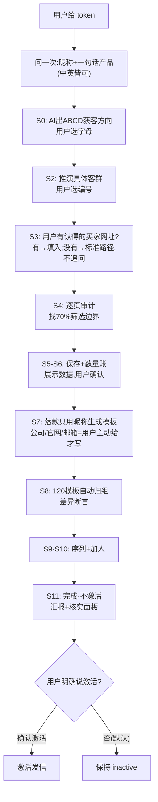

# 🧭 来发信 B2B 获客 · Skill 入口

> **一句话定位**：把"产品 → 推演客群/找种子 → 域名搜相似 → AI 反思 70% 临界 → 纯 API 保存前 N → 差异化模板 120 → 12 步序列 → contact-add → 不激活待确认"整条外贸获客流水线，做成**判据明确 + 工具硬闸门 + 全程留痕**的可执行流程。
> **本文件只做路由与判据摘要**；执行任何步骤前先读 `RULES.md`（唯一真源）及指向的 specs，禁止凭记忆跳步。
> **★定位话术**：本系统=**批量获客/广撒网拿询盘**，不是精准开发——"广撒网铺量拿询盘；人或 AI 助手发现回复后须立即打‘询盘’标签，邮件序列才会停发；之后由您人工背调和精准跟进"。
> **★用户展示话术=照模板**（把用户当小白）：每环节给用户看什么/怎么说，照 `output-templates/S<节点>-*.md` 填充输出（人话+链接+具体核对点）；平台页面直达链接见下方路由表。
> **断言分级纪律**：关键断言须标成色——实测✅/引用📚/推断⚠️/假设❓；写操作断言必须实测或小样实测+对账。

## 🗺 渐进引导图（AI 照此节奏要信息，禁止开局列清单）

> 每步只问当前必需的一件事；用户永远可以用"确认/否/要改"推进。（图为节奏简化：S1 折入 S3 分支、S9a 为内部固定标签步骤、ERROR_BLOCKED 为全局异常兜底——完整状态以 §3 状态机表为准。）
> **两个必出示的固化产出**：①登录检查通过 → 按 [S0-连接成功](output-templates/S0-连接成功.md) 展示账号状态卡（SVIP/配额/充值）②保存完成 → 按 [S6-数量账](output-templates/S6-数量账.md) 主动解释数量构成（未知邮箱默认已存；1.4~2.1 邮箱/家属正常）。

## 1️⃣ 触发场景路由表（用户说什么 → 去哪）

| 用户说（触发词） | 路由到 |
|------------------|--------|
| 新会话 / 换机 / 接手 / "接着上次" | `python3 tools/onboard_check.py`（自检+读本地状态）→ 本文件 → `RULES.md` |
| "更新到最新版 / 升级 / 老用户更新" | README「🔄 更新到新版本」办法 A 指令块=完整步骤：①判断安装方式（有 .git→git pull；无→ZIP 覆盖到**原目录**，禁解压新文件夹）②备份 `.local/` 与 `runs/` 到系统文件夹外（成功后可删）③git pull 遇冲突先停不强推；ZIP 覆盖后查"新版已删除的旧文件"残留，列出问用户再清，不自删 ④跑 `python3 tools/onboard_check.py` 体检 → 汇报新版本号 + CHANGELOG 变化 + 数据完好核对 |
| "帮我找 X 产品的客户" / 开新项目 | §2 前置检查 → ① `python3 tools/check_login.py --token <T>`（登录检查）→ ② `bash tools/gate_check.sh --token <T>`（闸门）→ ③ `python3 tools/flow_orchestrator.py`（S0→S12 向导）|
| "我这产品适合跑吗 / 大宗 / 长周期 / 好几年才采购" | §2 → 登录检查/闸门 → `specs/product-fit.md`（强/条件/弱三档判定表）：S0 判定 + 如实告知弱适配预期，由用户决定（不拒绝、不静默）|
| "这客户/这批准不准" / "临界在哪" | 状态机 S4 → `specs/threshold-method.md`（AI 反思 70% 判据）+ `tools/audit_company.py`（⚠️仅趋势初筛）|
| "怎么才存了这么点 / 邮箱太少 / 数量对不上" | S6 数量账：`output-templates/S6-数量账.md`——四机制（max3/验真/去重/异步提取）逐项解释；**未知邮箱默认已保存**；<1.0 邮箱/家建议查锚点 |
| "保存这批 / 前 N 条" | 状态机 S5/S6 → `tools/save_first_n.py`（★必须带 S5 的 `--approval`）|
| "写开发信 / 模板 / 预览" | 状态机 S7 → `tools/gen_templates.py --preview`；S8 生成后必跑 `tools/check_template_diff.py`（模板**自动归入同名分组**，禁散落"未指定目录"）|
| "建序列 / 跟进计划" | 状态机 S9 → `python3 tools/build_sequence.py --tmap runs/<运营方>/<产品>/tmap.json --approval <S9凭证>`（tz/notSentTags 运行时解析+12 步；规范 `specs/sequence-config.md`）|
| "加联系人 / 进序列" | 状态机 S10 → `python3 tools/contact_add.py --seq <id> --tags <标签id> --task <任务id> --approval <S10凭证>`（内置时序守卫+views:[] 铁律）|
| "激活 / 发信" | S12：仅用户明确"确认激活" → **`python3 tools/activate_sequence.py --seq <id> --confirm "<用户原话>" --approval <S12凭证> --project <产品>`**（激活+回读 status:active 防假成功）；★**空序列测完激活后须回滚 inactive**（防后续加联系人即真发）；发信前区分责任：平台负责发送基础设施与退订技术呈现，运营方仍须核验目标市场、名单来源、发送主体、实际退订入口与拒收要求 |
| "验证这批对不对" | `tools/verify_exclude.py`（排除4区）/ `tools/verify_sequence.py`（12步）/ `tools/check_template_diff.py`（差异≥30%）|
| "模板重建 / 换模板" | `tools/rebuild_templates.py`（⚠️半自动，顺序铁律见 L-43，需人工分步）|
| "清空重来" | 危险操作，先用户确认。产品档案清空：`python3 tools/delete_all_products.py`（默认 dry-run，--execute --confirm "DELETE-ALL" 才真删）；联系人/模板清空按 `specs/api-reference.md` 清空工具节封装 |
| "出问题了 / 记教训" | 本地问题登记（`db/issues.tsv`，本地数据不入 Git）+ `lessons/lessons-learned.md` |
| **"对抗审查 / 这个准不准 / 审一下"** | **RULES.md「🛡 操作对抗审查」（★用户强制：决策/产出必经空白子代理对抗）→ 按四类固定清单/执行前反思矩阵审 → 产出 `dialogue/reviews/rev-<日期>-<时分>-<操作>.md`（只放行/整改P0P1P2）→ 写操作三凭证：用户确认(approvals)+对抗审查(reviews)+操作流水(ops-log)** |
| "账号什么等级 / 配额多少 / 点数够不够 / SVIP" | 连接检查即显示：`tools/check_login.py`（vip=2 显示 SVIP；今日/本月配额+剩余；充值次数/自动充值）→ 话术 [S0-连接成功](output-templates/S0-连接成功.md)；接口无余额/到期字段，禁止编造 |
| "查当前数据 / 最近跑批" | 本地运行记录（`db/runs.tsv`，本地数据不入 Git）+ 本地状态（`.local/`）|
| **"询盘来了 / 回复后不回 / 怎么背调 / WhatsApp / LinkedIn / 电话跟进"** | `docs/09-mass-outreach-to-precision-follow-up.md`：先打账号固定标签「询盘」停自动群发 → 公司/联系人背调 → A/B/C/D 分级 → 邮件为主；仅在已有明确许可并满足目标市场规则后使用 WhatsApp/商务社媒/电话；明确拒绝→「不发」停邮件，并人工登记全渠道停止。群发找信号，精准跟进做转化 |

## 2️⃣ 必备前置（硬条件，缺一停）

- **★第一步=登录检查**：`python3 tools/check_login.py --token '<T>'`（只读；org 自动从 token 提取）。无 token/失效 → **引导用户**按官方教程获取后发来：https://www.laifa.xin/share/ai/laifaxin-ai-account-connection
  - 方法一(小白)：登录 web.laifaxin.com → 右键"检查"→"应用程序"→本地存储→web.laifaxin.com→accesstoken→复制"值"整串
  - 方法二(更快)：检查→控制台→`copy(localStorage.getItem("accesstoken"));`→undefined=已复制；null=未登录→刷新/重登
  - ★请用 Chrome 或 Edge 打开 web.laifaxin.com（其他浏览器界面可能不同）
  - 粘贴时浏览器可能提示 "Don't paste code"（防骗保护，正常现象）——核对命令一致后按提示输入 allow pasting 再粘贴
  - 安全边界：token 等同登录凭证，只发给你信任的 AI（本流程仅用于你会话、不写文件）；不要发群聊/工单/公开文档
  - 首次连接只做只读检查（不搜客/不保存/不扣点/不发信）；换账号需重新获取
- **★最小必要输入（2026-09-03 用户拍板：渐进索取，禁止开局列清单）**：
  - **开跑只问 2 项**：① **token** ② **昵称 + 一句话产品**（如"我卖不锈钢保温杯，主要卖欧美"）。中文或英文任一均可理解，不要因为语言形式重复追问。
  - **★昵称规范（2026-09-03 用户拍板）**：昵称**只含个人称呼**（Tony / Iris 等纯人名）；发现含公司名/产品名/职位（如 "Iris | XX Textiles"、"保温杯厂-老王"）→ **一次性说明并请用户改**："昵称建议只放个人名字，公司信息可以放邮件正文——您想改成什么？"
  - **后续节点用到现在才要**：S0 出 A/B/C/D 方案选字母；S2 出具体客群表选编号（两步分工，不重复问）；S3 用户可给一个认得的买家网址（没有就走标准路径，不追问）；S7 落款只用昵称，公司/官网/邮箱用户主动给才写。
  - **★用户主动给的网址/卖点=高价值信号，立即消化（2026-09-03 拍板）**：用户给出自己的官网/产品页/卖点文字时，AI 主动**读取并分析**——提炼产品线/核心优势/目标客群/差异化卖点，产出一份"公司与产品速览"给用户确认（内容仅用于：客群方向更准、开发信卖点更真实），然后反哺 S0 方案与 S7 文案。★速览与用户一句话产品/目标市场冲突时，**以用户口径为准**并标注差异。**是 AI 去查去分析，不是让用户解释**。
  - **永远不主动要**：公司名、官网、联系邮箱、认证、产能、MOQ 等——用户主动给了才选用；没有时按行业合理值表述，不编造具体数字。
  - 每次**只问当前节点必需的一件事**，给默认建议，用户回复"确认/否/要改"即可推进。
- **闸门硬条件**：`bash tools/gate_check.sh --token <TOKEN>` 全部通过 = 开始流程的**唯一通行证**；未通过**禁止任何保存/模板/序列/contact-add**。
- 缺 ① 或 ② → **停，向用户要，不猜不代填**。
- token 只放命令/环境变量，**绝不写入任何文件**。
- 本地运营方档案（`.local/operator-profile.md`，首次运行自动生成）：用户主动提供的公司名/官网/邮箱才记录；**没提供就不写这些字段，落款只用昵称**——模板正文不得编造公司信息，但也不得为此向用户索要。

## 3️⃣ 状态机 S0-S12（每节点一句话判据，细节见 RULES.md）

| 节点 | 一句话判据 |
|------|-----------|
| S0 INPUT_GATE | **只需昵称+一句话产品**（中英皆可）。★S0 出 A/B/C/D **获客方向方案**（含推荐与淘汰理由），用户选字母——禁止开局索要清单。★用户主动给官网/卖点 → AI 读取分析产出"公司与产品速览"，反哺客群与文案。★**产品适配度判定（只读前置）**：出方案前先按 `specs/product-fit.md` 四问判 **强/条件/弱适配**，结论+理由随 ABCD 方案一起展示；弱适配必须如实说明预期（冷邮件回询盘以月/年计，建议小样验证），由用户决定，不静默走流程 |
| S1 PATH_PENDING | 有精准网址→快速路径 A；无→标准路径 B **自动选择，不追问**（用户随时可补网址切换） |
| S2 SEGMENT_PENDING | 推演 4 客群，逐个判"会不会采购"+周期/询盘/量级/邮箱/竞争度，给推荐，用户确认（★档案=**推理档案** inference-product-add，非 product-add，否则 generate 500；generate 后轮询 list 至非空）|
| S3 SEED_PENDING | AI 数据库搜索链三步：①query_en 搜第一页（25字段/条，含 id、无 domain）②代表买家 id→`domain/base-info` 取域名 ③域名作 keyword 走主搜扩量（禁 similar-list）→用户确认锚点；随后 S4 审计、S5/S6 按审计关键词保存（域名/长文本均实测✅） |
| S4 AUDIT_RUNNING | 只读+AI 语义反思找 70% 临界（50页跳→三页平均→逐页→跌破往前）；**★按 v2 三条客户线(直采/OEM/拓品)逐条判定+判定表留痕+边界敏感性检查**；未完成不能保存 |
| S5 SAVE_PENDING | 展示临界 N/标签/排除4区/max/点数，用户确认后才保存（→输出 approval_id）|
| S6 SAVE_RUNNING | front 保存；等任务 status:finished；用标签结果对账。★完成后主动出示**数量账**（S6-数量账.md：max3/验真/去重/异步四机制；1.4~2.1 邮箱/家属正常，<1.0 查锚点） |
| S7 TEMPLATE_PENDING | 只生草稿，展示 3-8 个**渲染后视图**+理由，确认后才批量创建。★正文署名只用昵称；公司名/官网/邮箱**仅在用户已主动提供时**写入，禁止主动索要 |
| S8 TEMPLATE_BUILD | 生成 120 模板并**自动归入同名分组**（禁散落未指定目录），断言变量样式/标题/差异（Jaccard≤0.70），失败回 S7 |
| S9 SEQUENCE_PENDING | 12 步(30分/5/15/30天)+纽约时区+单日30000/单家5+notSentTags，确认后建。★客群成交/询盘周期以季~年计时（条件/弱适配），如实告知节奏为快周期设计，建议调低轮次或改人工培育 |
| S9a FIXED_TAGS | 账号固定标签“询盘/不发”：先查同名，存在复用 id，不存在才建；不随产品重复创建，记录 id(名称) |
| S10 CONTACT_PENDING | finished+标签联系人>0+序列 inactive+对账+确认后 contact-add(views:[]) |
| S11 READY_INACTIVE | 输出完整流程与参数，测试不激活，发"流程待确认"。★**用户核实面板**六条：①标签 id(名称)成对表 ②客群+客群代表完整名单(每客群第一页10条) ③保存范围+抽样页判定数据 ④跨轮模板渲染样例≥5封(收件人视图) ⑤其他事实(配额消耗/事故披露/未验证项标注) ⑥逐环节审查确认矩阵——入 runs/<产品>/verification-panel.md |
| S12 ACTIVE | 仅用户明确"确认激活"才激活；激活前 AI 逐项自查市场/名单/主体/退订/拒收并展示，用户只做最终确认 |
| ERROR_BLOCKED | 异常/参数变/对账不一致 → 只读检查，禁写 |

## 🔗 平台页面直达（给用户的核实链接，2026-09-03 用户拍板：让用户自己看）
登录 web.laifaxin.com 后，告诉用户直接打开：
| 看什么 | 页面 | 链接 |
|---|---|---|
| 邮件模板（120 个）| 模板库 | https://web.laifaxin.com/settings/templets |
| 序列（12 步计划/inactive 状态）| 智能跟进 | https://web.laifaxin.com/mailing/sequence |
| 保存的客户任务 | 已保存任务 | https://web.laifaxin.com/search/saved-tasks |
| 发信设置 | 邮件营销 | https://web.laifaxin.com/mailing/send |
| 时区计划 | 计划时间 | https://web.laifaxin.com/settings/time-plan |
| 联系人/标签 | 登录后左侧菜单「联系人」 | （按菜单进，搜标签名即得）|
> 给用户的话术模板："您打开 <链接>，找 <名称>，核对 <什么>"——每项核实点写具体。

## 4️⃣ 铁律摘要（0-8，违反即错，详见 RULES.md）

0. **排除中国 4 区** CN/TW/HK/MO——保存与 S4 扩量搜排除；S3 文本搜不排除（schema：`values:[]` + `value:""` + `valueType:"select"`）
1. 保存 `selectOption:"front"`（≠current，current 邮箱 0）+ `contactMaxCount:3`（不足才 3→6→9 升阶）
2. 模板变量 `<code class="lfxFieldVeriable" contenteditable="false">{联系人:名称}</code>`；标题纯文案；差异≥30%（实测 Jaccard≤0.70）
3. 不翻页收集 id（封号）——保存前 N 用 `selectTotal=前N条数`
4. 验证用 `backend-task-status`（contactSaveCount）；删除进度用 `backend-progress`
5. 发信前去重；单日 30000/单家 5；notSentTags=[询盘,不发]。平台负责发送技术基础设施；激活前 AI 逐项自查市场/名单/主体/退订/拒收并展示结果，用户只做最终确认。
6. **时序**：等保存 `status:finished` + 标签联系人>0 后才 contact-add
7. **标签=客户群体身份 `语言-行业-角色`**（不是你的产品）；记录一律 `id(名称)` 成对
7a. **署名=纯个人昵称**（禁公司名/产品名/职位入昵称与落款）；公司/官网/邮箱用户主动给才写正文
7b. **保存邮箱口径=valid+unkown 都存**（未知邮箱默认保存）；数量落差四机制主动向用户解释（S6-数量账）
7c. **语言三方配对**：标签/模板/序列语言一致才 contact-add（西语客群禁收英语信）——contact_add.py 内置守卫
8. 内部命名（标签/视图/序列/模板分组）一律中文；邮件正文=目标市场语言（默认全球英语）

## 5️⃣ 新会话三步走

1. `python3 tools/onboard_check.py`（自动打印读什么/当前状态/下一步）
2. 读 `.local/` 本地状态（当前状态+下一步，勿重头；首次运行自动生成）
3. 读 `RULES.md`（唯一真源）→ 向用户要 token+昵称+一句话产品 → ①`tools/check_login.py`(登录检查) → ②`tools/gate_check.sh`(闸门) → ③按状态机逐节点跑

## 6️⃣ 关键文件地图

| 类别 | 文件 |
|------|------|
| 规则（唯一真源） | `RULES.md` → `specs/api-reference.md`（接口模板）/ `specs/threshold-method.md`（70%临界）/ `specs/product-fit.md`（产品适配度三档·S0前置）/ `specs/domain-scale-sop.md`（域名搜+保存）/ `specs/sequence-config.md`（模板+序列）/ `specs/operations-sop.md` |
| 流程逻辑 | `methodology/decision-trees.md`（A/B 路径图）/ `INDEX.md`（导航）|
| 当前状态 | `.local/`（本地状态+运营方档案+审批凭证；首次运行自动生成，每账号/每 clone 一份，不入 Git）|
| 工具（工具=规则） | `tools/gate_check.sh`、`onboard_check.py`、`check_login.py`（登录+账号状态卡）、`flow_orchestrator.py`、`approval.py`、`seed_resolve.py`（S3 id→域名）、`tag_add.py`（S5 前置建标签，同名复用）、`save_first_n.py`（内置数量账输出）、`wait_save_done.py`、`gen_templates.py`（自动归组）、`check_template_diff.py`、`build_sequence.py`（S9，公司触发器=什么都不做）、`contact_add.py`（S10）、`activate_sequence.py`（S12 激活+回读防假+--deactivate）、`resolve_schedule.py`、`verify_exclude.py`、`verify_sequence.py`、`rebuild_templates.py`、`audit_company.py`、`render_preview.py`、`check_rules.sh`（AI 自查 token/规则/问题）|
| 用户话术模板 | `output-templates/`（README=总索引；T-token/S0连接+画像/S2/S3/S4审计中/S5/S6数量账/S7/S8构建中/S9/S10/S11/S12/Q1-Q5 15 个话术模板+1 个总索引——每模板=用户话术+AI执行要点与边界）|
| 档案（多公司多产品） | `runs/<运营方>/<产品>/`（operation-record/reflection/evidence/verify-*）+ `runs/_template/` + 本地运行记录（不入 Git）|
| 问题与教训 | 本地问题登记（`db/issues.tsv`，本地数据不入 Git，open 即待办）/ `lessons/lessons-learned.md`（L-01~L-53；L-44 起为脱敏抽象条目，随库分发）/ `review-cycle.md`（旁观者审查）|

> ⚠️ **执行纪律**：写操作工具必须带 `--approval <id> --project <产品>`（审批硬闸门·工具级，凭证在 `.local/approvals.tsv`）；每次操作前先读 RULES+对应 spec；本 SKILL.md 只是入口，与 RULES/specs 冲突时以后者为准。
> 🆘 新手黑话/常见疑惑：`glossary/glossary.md`（系统词人话表）· `wiki/faq.md`（配额/接口空/数量落差/None 等FAQ）· 渐进索取/昵称/署名/账号状态卡规则见上方 §2 与 output-templates/
> ⚠️ **审批闸门边界（防呆不防恶）**：`--approval` 校验的是本地 `.local/approvals.tsv`（每账号/每 clone 一份，不入 Git），该文件对本机 AI 可写——**自证行 ≠ 用户授权**。高风险操作（保存/建序列/加联系人/激活）仍必须在对话中出示用户原话；AI 自行 append 的凭证视为无效（审批补记·内部教训）。
> 🔑 **凭证出口**：`flow_orchestrator.py` 确认节点是 approval 凭证的**唯一合法出口**；审批补记（内部）的 backfilled 行不构成写授权。新 AI 给新产品写开发信文案前，先按「新产品文案军规」执行（数字可举证/标准写到底/禁假前提假稀缺/环保具体化/CTA 轮换——见 docs/07 与 specs/sequence-config.md）。
