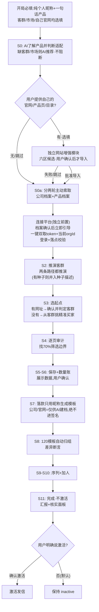

# 🧭 来发信 B2B 获客 · Skill 入口

> **一句话定位**：把"产品 → 推演客群/找种子 → 域名搜相似 → AI 反思 70% 临界 → 纯 API 保存前 N → 差异化模板 120 → 12 步序列 → contact-add → 不激活待确认"整条外贸获客流水线，做成**判据明确 + 工具硬闸门 + 全程留痕**的可执行流程。
> **本文件只做路由与判据摘要**；执行任何步骤前先读 `RULES.md`（唯一真源）及指向的 specs，禁止凭记忆跳步。
> **★定位话术**：本系统=**批量获客/广撒网拿询盘**，不是精准开发——"广撒网铺量拿询盘；人或 AI 助手发现回复后须立即打‘询盘’标签，邮件序列才会停发；之后由您人工背调和精准跟进"。
> **★用户展示话术=照模板**（把用户当小白）：每环节给用户看什么/怎么说，照 `output-templates/S<节点>-*.md` 填充输出（人话+链接+具体核对点）；平台页面直达链接见下方路由表。
> **断言分级纪律**：关键断言须标成色——实测✅/引用📚/推断⚠️/假设❓；写操作断言必须实测或小样实测+对账。

## 🗺 用户选择“开始新项目”后的渐进引导图（禁止安装后自动进入）

> 每步只问当前必需的一件事；用户永远可以用"确认/否/要改"推进。（图为节奏简化：S1 折入 S3 分支、S9a 为内部固定标签步骤、ERROR_BLOCKED 为全局异常兜底——完整状态以 §3 状态机表为准。）
> **两个必出示的固化产出**：①登录检查通过 → 按 [S0-连接成功](output-templates/S0-连接成功.md) 展示账号状态卡（SVIP/配额/充值）②保存完成 → 按 [S6-数量账](output-templates/S6-数量账.md) 主动解释数量构成（未知邮箱默认已存；1.4~2.1 邮箱/家属正常）。

## 1️⃣ 触发场景路由表（用户说什么 → 去哪）

| 用户说（触发词） | 路由到 |
|------------------|--------|
| "安装 / 第一次安装 / 学习这个 Skill / 帮我装好" | **只执行安装学习阶段**：下载或识别旧安装→保留 `.local/`/`runs/` 更新→自动准备环境→通读 README/SKILL/RULES/specs→运行 onboard 自检+扫描旧项目→汇报后只问“安装完成。你现在想做什么？”；🔴此阶段禁止问产品/市场/官网/昵称/token，不得默认建新项目 |
| "新电脑第一次安装" / 环境缺 Python / `python` 找不到 | `specs/environment-setup.md` → `bootstrap.sh --install` 或 Windows `bootstrap.ps1 -Install` → check-only → onboard；完成后回到任务选择，不自动进入 S0。⚠️PowerShell脚本当前仅静态检查、未在全新Windows实机跑完；失败按SOP官方安装兜底 |
| 新会话（同机） / "接着上次" | `onboard_check.py` 枚举可续接项目并展示任务菜单；有项目先让用户选择是否续接，再读 operation-record + product-profile 从当前节点继续；无项目也不自动建新项目，仍等待用户选择任务 |
| "换机 / 换电脑 / 另一台电脑接手" | README「💻 换电脑继续干」完整指令块 + `specs/migration-handoff.md`：旧机迁移 `.local/`+`runs/`+可选本地`db/` → 新机恢复同名路径 → token重新获取 → onboard枚举项目 → 禁止从S0重跑已有项目 |
| "更新到最新版 / 升级 / 老用户更新" | README「🔄 更新到新版本」办法 A：判断 git/ZIP → 备份 `.local/`+`runs/` → 更新原目录 → bootstrap check-only → 用输出的 `python_cmd` 跑 `onboard_check.py` → 汇报版本/变化/数据完好；冲突或旧文件残留先列出问用户，不强推不自删 |
| "帮我找 X 产品的客户" / 明确选择“开始新项目” | 用户已选择业务任务后才进入：S0 昵称+一句话产品 → S0a 建档/确认 → 登录检查 → gate → `flow_orchestrator.py --product <product_key> --product-info <用户产品说明> --profile <档案>`；`--product` 必须与 profile.product_key 逐字一致，不是中文展示名 |
| "我有官网 / 这是我们网站 / 产品页 / 产品目录 / 帮我了解公司和产品 / 优化定位" | **可选独立模块** `specs/website-profile-sop.md` → 先确认网址角色 → AI 读取公开页并生成六区候选 → `tools/website_profile.py` 校验/准备补丁/批准/正式档案单文件原子写入；失败或跳过不阻断 S0/S0a，不修改线上网站；买家网址转 S3 |
| "先了解完整流程 / 先看看怎么用 / 暂时不操作" | 只用通俗中文解释 README 的新项目流程图、产品适配、确认节点、默认不发信和询盘后人工跟进；**不索取产品/市场/官网/昵称/token，不执行 S0 或任何平台操作**；讲完停下等用户选择任务 |
| "我这产品适合跑吗 / 大宗 / 长周期 / 好几年才采购" | 只问卖什么（已有就不重复问），按 `specs/product-fit.md` 强/条件/弱三档做只读判断并如实说明预期；不要求昵称或 token，不自动启动新项目 |
| "这客户/这批准不准" / "临界在哪" | 状态机 S4 → `specs/threshold-method.md`（AI 反思 70% 判据）+ `tools/audit_company.py`（⚠️仅趋势初筛）|
| "怎么才存了这么点 / 邮箱太少 / 数量对不上" | S6 数量账：`output-templates/S6-数量账.md`——四机制（max3/验真/去重/异步提取）逐项解释；**未知邮箱默认已保存**；<1.0 邮箱/家建议查锚点 |
| "保存这批 / 前 N 条" | 状态机 S5/S6 → `tools/save_first_n.py`（★必须带 S5 的 `--approval`）|
| "写开发信 / 模板 / 预览" | 状态机 S7 → `tools/gen_templates.py --preview`；S8 生成后必跑 `tools/check_template_diff.py`（模板**自动归入同名分组**，禁散落"未指定目录"）|
| "建序列 / 跟进计划" | 主 AI 内部调用 `build_sequence.py --token <TOKEN_IN_MEMORY> --org <ORG_IN_MEMORY> ...`；内存占位不得让用户设置变量或执行命令。其余参数：序列名、tmap、profile、record、纯昵称、项目键、S9审批 |
| "加联系人 / 进序列" | 主 AI 内部调用 `contact_add.py --token <TOKEN_IN_MEMORY> --org <ORG_IN_MEMORY> ...`；内存占位不得让用户处理。查询失败/active/状态不符均fail-closed，views固定[] |
| "激活 / 发信" | S12唯一凭证出口：项目必须已真实收口S11 → compliance-check `evidence_mode=live`且五项72h真实证据 → 用 `flow_orchestrator --resume-s12` 当前TTY现场确认，只签绑定凭证、不联网/不激活 → 主AI调用activate并真实回读active。普通flow末尾不得签S12；approval grant也禁止S12 |
| "验证这批对不对" | `tools/verify_exclude.py`（排除4区）/ `tools/verify_sequence.py`（12步）/ `tools/check_template_diff.py`（差异≥30%）|
| "模板重建 / 换模板" | `tools/rebuild_templates.py`（⚠️半自动，顺序铁律见 L-43，需人工分步）|
| "清空重来" | 危险操作，先用户确认。产品档案清空：`python3 tools/delete_all_products.py`（默认 dry-run，--execute --confirm "DELETE-ALL" 才真删）；联系人/模板清空按 `specs/api-reference.md` 清空工具节封装 |
| "出问题了 / 记教训" | 本地问题登记（`db/issues.tsv`，本地数据不入 Git）+ `lessons/lessons-learned.md` |
| **"对抗审查 / 这个准不准 / 审一下"** | **RULES.md「🛡 操作对抗审查」（★用户强制：决策/产出必经空白子代理对抗）→ 按四类固定清单/执行前反思矩阵审 → 产出 `dialogue/reviews/rev-<日期>-<时分>-<操作>.md`（只放行/整改P0P1P2）→ 写操作三凭证：用户确认(approvals)+对抗审查(reviews)+操作流水(ops-log)** |
| "值得跑吗 / 多少钱 / 399 / 15天SVIP / 没询盘怎么办 / 48小时几个询盘算合格" | `docs/09`「算一笔账+验证裁决」：零成本先领 15 天 SVIP（联系客服）→ 399/年 SVIP 正式一波 → **48 小时数有效询盘：≥3 合格扩大（询盘网址=新种子），<3 诊断漏斗（送达→打开→回复）换角度再试，连续两轮不达标止损** |
| "账号什么等级 / 配额多少 / 点数够不够 / SVIP" | 连接检查显示：账号等级、今日/本月配额；接口同时返回有效字段时再显示充值次数/自动充值 → 话术 [S0-连接成功](output-templates/S0-连接成功.md)。接口无余额/到期字段，禁止编造 |
| "查当前数据 / 最近跑批" | 本地运行记录（`db/runs.tsv`，本地数据不入 Git）+ 本地状态（`.local/`）|
| **"询盘来了 / 回复后不回 / 怎么背调 / WhatsApp / LinkedIn / 电话跟进"** | `docs/09-mass-outreach-to-precision-follow-up.md`：先打账号固定标签「询盘」停自动群发 → 公司/联系人背调 → A/B/C/D 分级 → 邮件为主；仅在已有明确许可并满足目标市场规则后使用 WhatsApp/商务社媒/电话；明确拒绝→「不发」停邮件，并人工登记全渠道停止。群发找信号，精准跟进做转化 |

## 2️⃣ 新获客项目的必备前置（用户明确选择后才执行，缺一停）

- **★首次调用来发信平台前必过=登录检查**（不是安装或对话开局第一句）：到此节点仍无凭据/已失效，才按官方教程引导用户**在浏览器一键复制后，把 `accesstoken=` + `orgId=` 两行整段直接粘贴到当前聊天框**：https://www.laifa.xin/share/ai/laifaxin-ai-account-connection
  - **⭐用户唯一操作（一条命令两样全拿）**：登录并切换到要操作的来发信工作空间 → 页面右键“检查”→“控制台”→粘贴这一行并回车：
    `var t=localStorage.getItem("accesstoken");t&&t!=="null"?(copy("accesstoken="+t+"\norgId="+localStorage.getItem("orgId")),"✅ 已复制到剪贴板！回到对话框 Ctrl+V（Mac按⌘V）粘贴发送给 AI"):(location.host.indexOf("laifaxin")<0&&location.host.indexOf("worldtradetool")<0?"❌ 你现在打开的网页（"+location.host+"）不是来发信——新开标签页访问 web.laifaxin.com 并登录，再按 F12 打开控制台重新粘贴本命令":"❌ 来发信页面上没取到登录凭证——先看右上角有没有你的账号头像：没有=先登录；有=按 F5 刷新后再运行一次（不用退出重登）");`
    →成功回显 ✅ 后，用户只需回到**当前聊天框直接粘贴并发送**。禁止让用户拆分、设置 TOKEN/ORG 变量、创建 `.env` 或执行 Python/Shell 命令。**主 AI** 不回显/不落盘/不写日志/不传子代理；用宿主程序化 stdin 将整段交给 `check_login.py --credentials-stdin`，禁止 heredoc、`printf |` 或把凭据拼进工具调用文本。
  - 🔴 **orgId=工作空间ID，与 token 中段（用户ID）是两回事**：个人账号二者只是恰好相同；企业账号 orgId 是独立值，必须从 localStorage 一键双取。缺 orgId 时所有账号一律停止，禁止回退 token 中段或默认个人空间
  - 🔴 **拿到凭据后必须做"落点校验"，不能只看接口成功**：`?uid=` 只是请求参数，token 对该 org 无权限时平台会**静默落回 token 自己的空间**且仍返回成功——所以"接口成功 + 参数回显一致"证明不了空间对。登录检查后立刻跑 `python3 tools/workspace_guard.py --credentials-stdin --require-verified`（`gate_check.sh` 的 `[2b]` 也会跑）；命中"声明企业却判个人"或"判企业却 orgId==用户UID"必须停止，让用户切到目标空间重新一键双取。汇报只能说"落点校验通过"或"未校验"，禁止用参数一致冒充空间正确。
  - ★请用 Chrome 或 Edge 打开 web.laifaxin.com（其他浏览器界面可能不同）
  - 粘贴时浏览器可能提示 "Don't paste code"（防骗保护，正常现象）——核对命令一致后按提示输入 allow pasting 再粘贴
  - 安全边界：token 等同登录凭证，只发给你信任的 AI（本流程仅用于你会话、不写文件）；不要发群聊/工单/公开文档
  - 首次连接只做只读检查（不搜客/不保存/不扣点/不发信）；换账号/切 org 需重新获取两样
  - 🔴 **token 单点有效**：用户在其他设备/浏览器登录、或网页重新登录 → 旧 token 立即作废——"token已失效"时引导重登+一键重取，同一份反复重试无意义（check_login 会计数升级提示）
  - ℹ️ token 开头域名可能是 web.laifaxin.com 或 web.worldtradetool.com 等——均正常，勿按域名判真伪
- **★最小必要输入（2026-09-07 对抗收口：渐进索取，禁止开局列清单）**：
  - **对话开局只问 1 类**：**纯个人昵称 + 一句话产品**（如“Tony；我卖不锈钢保温杯”）。卖给谁、卖到哪、自己的官网/产品页/目录全部选填；没给时 AI 先推荐客群/市场，不阻断、不重复追问、不冒充用户输入。
  - **首次调用来发信平台前再问第 2 类**：用户在浏览器一键复制 `accesstoken=` + `orgId=` 两行后，直接粘贴到当前聊天框。AI 经 stdin 做只读检查；缺任一字段必须停止，不回退、不要求用户拆参数
  - **★昵称规范（2026-09-09 模拟补强）**：只含一个纯个人称呼。英文名与中文名混合一律拒绝；中文昵称须为2-4个纯汉字，带连字符或厂/包装/食品/机械等公司产品词拒绝。Tony / Jean-Pierre / 老王 / 张伟 / 欧阳娜娜可用；`Tony-包装厂`、`王-包装厂`、`张伟食品包装`不可用。公司资料只入本地档案，不进入邮件签名。
  - **后续节点用到现在才要**：S0 出 A/B/C/D 方案选字母；S2 出具体客群表选编号（两步分工，不重复问）；S3 优先引导用户给起点网址（询盘客户/认得的精准买家）；没有则从已推演客群挑精准买家，不重复追问；S7 邮件签名只用昵称——公司/官网/邮箱（用户自己的商业资产）AI 主动要 **仅供 AI 建档/背调**，绝不写进邮件签名。
  - **★产品资料=获客必需素材，用户不给AI也主动要**：公司级资料按 `operator-profile-sop.md` 回落 `.local/operators/<operator_key>.md`；产品级资料按 `product-profile-sop.md` 回落 `runs/<operator_key>/<product_key>/product-profile.md`。每次单独问一组，给填空模板、可跳过、不逼问。★**邮件边界**：邮件末尾签名区永远只有纯个人昵称；公司名/官网/联系邮箱不进入签名；经用户确认且有字段级来源的认证/产能/MOQ/交期/价格带可用于正文卖点；推断或无来源的具体事实禁止写入。★潜在买家/客户/联系人第三方联系方式不索要、不写入上述档案。S2/S4/S7/S9 必须绑定当前 profile path/version/hash；零上下文续接先读两类档案。
  - **公司级/产品级资料都可主动要**（每次单独问一组，给模板可跳过）：公司名/官网/联系邮箱/默认市场→operator-profile；产品线/认证/产能/MOQ/交期/价格带→product-profile。签名区只含昵称；confirmed 且有来源的产品事实可进正文卖点；没有事实时只用无具体承诺的通用表达。
  - 每次**只问当前节点必需的一件事**，给默认建议，用户回复"确认/否/要改"即可推进。
- **闸门硬条件**：主 AI 将聊天框收到的两行整段通过程序化 stdin 交给 `bash tools/gate_check.sh --credentials-stdin --product <项目键>`（★bash 脚本，勿用 python3 调用）；全部通过才是平台流程通行证。未通过禁止任何保存/模板/序列/contact-add。旧 `--token/--org` 只作 AI 内部兼容，不得向用户展示
- 缺开局的昵称/产品 → **只问缺项，不猜不代填**；到首次平台调用仍缺 token/orgId → 再引导一键双取并停在连接闸门。
- 原始凭据只允许由当前受信任主 AI 临时处理；仓库工具**禁止文件、`.env`、持久环境变量、工具日志、完整回显和子代理扩散**（失效计数仅存短哈希/次数）。聊天服务是否保存对话取决于宿主隐私政策。后续仍需纯 token/org 参数的内部工具，由主 AI 在内存中解析并调用；不得把拆分工作交给用户，也不得误把两行整段传给只接受纯值的工具。
- 本地运营方档案（`.local/operators/<operator_key>.md`，旧单文件兼容）：昵称为必需；公司名/官网/邮箱可主动要、跨产品/换机复用；签名区只昵称，客户第三方资料不写入。

## 3️⃣ 状态机 S0-S12（每节点一句话判据，细节见 RULES.md）

| 节点 | 一句话判据 |
|------|-----------|
| S0 INPUT_GATE | **必填只有昵称+一句话产品**（中英皆可）；卖给谁/卖到哪/自己的网址均选填。缺客群或市场时 AI 先推荐，不阻断、不冒充用户输入。S0 出 A/B/C/D **获客方向方案**（含推荐与淘汰理由），用户选字母。用户给自己的官网/目录/产品页 → 只走独立 `website-profile-sop.md` 六区候选，批准补丁后才导入；买家网址转 S3；模块失败/跳过继续原流程。用户给卖点文字/文件 → 按用户来源提炼；没给 → 邀请补充一次、可跳过。★出方案前按 `specs/product-fit.md` 四问判 **强/条件/弱适配**，弱适配如实说明预期，由用户决定 |
| S0a PROFILE_PENDING | 分两轮主动索取：①公司级资料→`.local/operators/<operator_key>.md`（多公司隔离/跨产品/换机复用）②产品级资料→`runs/<operator_key>/<product_key>/product-profile.md`。每轮一组、可跳过不逼问；产品档案必须 confirmed 或 declined 才能进 S1，draft 阻断；后续绑定版本/hash |
| S1 PATH_PENDING | **连接平台为独立前置**：档案确认后先按 `T-token引导.md` 引导一键双取→check_login+workspace_guard+gate 全过，才进选起点。有精准网址→快速路径 A；无→标准路径 B **自动选择，不追问**（用户随时可补网址切换） |
| S2 SEGMENT_PENDING | **两条路径都推演**（方案B：有种子时并入种子描述）；★**多客群分批**（铁律7d）：可选多个但每个客群独立标签/模板/序列，选中≥2个必须提示分开做并告知 K×120 模板+K 序列，一个客群走完 S3→S10 再做下一个；推演 4 客群，逐个判"会不会采购"+周期/询盘/量级/邮箱/竞争度，给推荐，用户确认（★档案=**推理档案** inference-product-add，非 product-add，否则 generate 500；generate 后轮询 list 至非空；★客群推演**优先读 product-profile.md** 的产品线/客群/卖点，推得更准）|
| S3 SEED_PENDING | ★入口二选一：有起点网址→确认并判定其客群；没有→从已推演客群挑精准买家。**起点必须关联客群**。AI 数据库搜索链三步：①query_en 搜第一页（25字段/条，含 id、无 domain）②代表买家 id→`domain/base-info` 取域名 ③域名作 keyword 走主搜扩量（禁 similar-list）→用户确认锚点；随后 S4 审计、S5/S6 按审计关键词保存（域名/长文本均实测✅） |
| S4 AUDIT_RUNNING | 只读+AI 语义反思找 70% 临界；按三条客户线留痕。正式收口须 `evidence_mode=live` 并绑定真实线上审计+独立review hash；模拟/离线/网络桩/占位只能出演练报告，禁止推进S4或保存 |
| S5 SAVE_PENDING | 展示临界 N/标签/排除4区/max/点数，用户确认后才保存（→输出 approval_id）|
| S6 SAVE_RUNNING | front 保存；等任务 status:finished；用标签结果对账。★完成后主动出示**数量账**（S6-数量账.md：max3/验真/去重/异步四机制；1.4~2.1 邮箱/家属正常，<1.0 查锚点） |
| S7 TEMPLATE_PENDING | 只生草稿，展示 3-8 个**渲染后视图**+理由，确认后才批量创建。★邮件末尾签名区只有纯个人昵称，禁止公司名/官网/邮箱/职位/认证/宣传语。★正文卖点只可使用当前 confirmed product-profile 中有字段级来源的事实（认证/产能/MOQ/交期/价格带等），计划绑定 profile hash 并逐句 claims 校验；declined 档案只用无具体事实通用表达 |
| S8 TEMPLATE_BUILD | 生成 120 模板并**自动归入同名分组**（禁散落未指定目录），断言变量样式/标题/差异（Jaccard≤0.70），失败回 S7 |
| S9 SEQUENCE_PENDING | 12 步(30分/5/15/30天)+纽约时区+单日30000/单家5+notSentTags，确认后建。★客群成交/询盘周期以季~年计时（条件/弱适配），如实告知节奏为快周期设计，建议调低轮次或改人工培育 |
| S9a FIXED_TAGS（S9内部子检查，不单独推进operation status） | 账号固定标签“询盘/不发”：build_sequence前先查同名，存在复用id，不存在才经绑定审批创建；notSentTags解析失败则S9 fail-closed |
| S10 CONTACT_PENDING | finished+标签联系人>0+序列 inactive+对账+确认后 contact-add(views:[]) |
| S11 READY_INACTIVE | 仅 `evidence_mode=live` 的 verification-manifest + 4份真实线上验证证据可正式收口；模拟/离线/网络桩/占位不得说“流程完成”或推进S11。正式收口后输出完整流程与参数，保持inactive，展示用户核实面板六条 |
| S12 ACTIVE | compliance-check须 `evidence_mode=live` 且五项为72小时内真实证据；模拟/离线/桩/占位拒签凭证和激活。S11项目用 `flow_orchestrator --resume-s12` 当前TTY只签绑定凭证（不联网、不激活），再由activate本地全闸通过后首次联网并回读active |
| ERROR_BLOCKED | 异常/参数变/对账不一致 → 只读检查，禁写 |

## 🔗 平台页面直达（给用户的核实链接，2026-09-03 用户拍板：让用户自己看）
登录 web.laifaxin.com 后，告诉用户直接打开：
| 看什么 | 页面 | 链接 |
|---|---|---|
| 邮件模板（120 个）| 模板库 | https://web.laifaxin.com/settings/templets |
| 序列（12 步计划/inactive 状态）| 智能跟进 | https://web.laifaxin.com/mailing/sequence |
| 保存的客户任务 | 已保存任务 | https://web.laifaxin.com/search/saved-tasks |
| 发信设置 | 邮件营销 | https://web.laifaxin.com/mailing/send |
| 时区计划 | 计划时间 | https://web.laifaxin.com/settings/time-plan |
| 联系人/标签 | 登录后左侧菜单「联系人」 | （按菜单进，搜标签名即得）|
> 给用户的话术模板："您打开 <链接>，找 <名称>，核对 <什么>"——每项核实点写具体。

## 4️⃣ 铁律摘要（0-8，违反即错，详见 RULES.md）

0. **排除中国 4 区** CN/TW/HK/MO——保存与 S4 扩量搜排除；S3 文本搜不排除（schema：`values:[]` + `value:""` + `valueType:"select"`）
1. 保存 `selectOption:"front"`（≠current，current 邮箱 0）+ `contactMaxCount:3`（不足才 3→6→9 升阶）
2. 模板变量 `<code class="lfxFieldVeriable" contenteditable="false">{联系人:名称}</code>`；标题纯文案；差异≥30%（实测 Jaccard≤0.70）
3. 不翻页收集 id（封号）——保存前 N 用 `selectTotal=前N条数`
4. 验证用 `backend-task-status`（contactSaveCount）；删除进度用 `backend-progress`
5. 发信前去重；单日 30000/单家 5；notSentTags=[询盘,不发]。平台负责发送技术基础设施；激活前 AI 逐项自查市场/名单/主体/退订/拒收并展示结果，用户只做最终确认。
6. **时序**：等保存 `status:finished` + 标签联系人>0 后才 contact-add
7. **标签=客户群体身份 `语言-行业-角色`**（不是你的产品）；记录一律 `id(名称)` 成对
7a. **署名=纯个人昵称**（禁公司名/产品名/职位入昵称与落款）；公司/官网/邮箱可主动要但**仅供 AI 建档**，绝不进邮件签名
7b. **保存邮箱口径=valid+unkown 都存**（未知邮箱默认保存）；数量落差四机制主动向用户解释（S6-数量账）
7c. **语言三方配对**：标签/模板/序列语言一致才 contact-add（西语客群禁收英语信）——contact_add.py 内置守卫
8. 内部命名（标签/视图/序列/模板分组）一律中文；邮件正文=目标市场语言（默认全球英语）

## 5️⃣ 新会话 / 换机三步走

1. **环境先就绪**：无 Python 先按 `specs/environment-setup.md` 跑 `bootstrap.sh/bootstrap.ps1`；环境全绿后运行 `python3|py tools/onboard_check.py`，让它枚举可续接项目。
2. **先让用户选任务**：有项目就报告项目和节点，只有用户选择“继续以前的项目”后，才读取 `operation-record.md` + `product-profile.md` + `reflection/evidence/verify-*` 并从当前节点继续，禁止从 S0 重跑；没有项目仍展示任务菜单，只有用户选择“开始新的获客项目”后才进入新建流程。
3. **换机先恢复本地状态**：按 `specs/migration-handoff.md` 从旧机迁移 `.local/`、`runs/<operator_key>/` 与可选本地 `db/`；token 在新机重新获取；历史 approvals 只作审计，未执行写节点与 S12 必须当前对话重新确认。

## 6️⃣ 关键文件地图

| 类别 | 文件 |
|------|------|
| 规则（唯一真源） | `RULES.md` → `specs/environment-setup.md`（零Python依赖准备）/ `specs/migration-handoff.md`（换机续接）/ `specs/operator-profile-sop.md`（公司级资料主动索取/跨产品复用）/ `specs/product-profile-sop.md`（产品资料提炼/确认/版本/hash/复用）/ `specs/website-profile-sop.md`（独立可选网站增强）/ `specs/product-fit.md`（适配三档）/ `specs/threshold-method.md`（70%临界）/ `specs/domain-scale-sop.md`（保存）/ `specs/sequence-config.md`（模板+序列） |
| 流程逻辑 | `methodology/decision-trees.md`（A/B 路径图）/ `INDEX.md`（导航）|
| 环境/迁移 SOP | `specs/environment-setup.md`（零 Python bootstrap）/ `specs/migration-handoff.md`（换机备份/恢复/续节点） |
| 当前状态 | `runs/<operator_key>/<product_key>/operation-record.md`（流程节点）+ 同目录 `product-profile.md`（资料状态/版本/hash）；`.local/` 只存运营方档案与审批流水，不是当前节点真源 |
| 工具（工具=规则） | `tools/bootstrap.sh`/`bootstrap.ps1`（无Python环境准备）、`onboard_check.py`（环境复查+可续接项目扫描）、`product_profile.py`/`profile_utils.py`（S0a档案状态/版本/hash+纯昵称/第三方信息闸门）、`gate_check.sh`、`check_login.py`（登录+账号状态卡）、`flow_orchestrator.py`、`approval.py`、`seed_resolve.py`（S3 id→域名）、`tag_add.py`（S5 前置建标签，同名复用）、`save_first_n.py`（内置数量账输出）、`wait_save_done.py`、`gen_templates.py`（profile+claims+签名硬闸门，自动归组）、`check_template_diff.py`、`build_sequence.py`、`contact_add.py`、`activate_sequence.py`、`resolve_schedule.py`、`verify_exclude.py`、`verify_sequence.py`、`rebuild_templates.py`、`audit_company.py`、`render_preview.py`、`check_rules.sh` |
| 用户话术模板 | `output-templates/`（README=总索引；T-token/S0连接+画像/S0a运营方档案+网站资料确认+产品知识档案/S2/S3/S4审计中/S5/S6数量账/S7/S8构建中/S9/S10/S11/S12/Q1-Q5 18 个话术模板+1 个总索引）|
| 档案（多公司多产品） | `runs/<运营方>/<产品>/`（operation-record/reflection/evidence/**product-profile**/verify-*）+ `runs/_template/` + 本地运行记录（不入 Git）|
| 问题与教训 | 本地问题登记（`db/issues.tsv`，本地数据不入 Git，open 即待办）/ `lessons/lessons-learned.md`（L-01~L-54；L-44 起为脱敏抽象条目，随库分发）/ `review-cycle.md`（旁观者审查）|

> ⚠️ **执行纪律**：写操作必须带 `--approval <id> --project <operator_key>/<product_key>`；凭证仅 `confirm+confirmed` 可用，并须与工具按实际参数重算的hash一致。modify/pending/backfilled不可授权。
> 🆘 新手黑话/常见疑惑：`glossary/glossary.md`（系统词人话表）· `wiki/faq.md`（配额/接口空/数量落差/None 等FAQ）· 渐进索取/昵称/署名/账号状态卡规则见上方 §2 与 output-templates/
> ⚠️ **审批闸门边界（防呆不防恶）**：`--approval` 校验的是本地 `.local/approvals.tsv`（每账号/每 clone 一份，不入 Git），该文件对本机 AI 可写——**自证行 ≠ 用户授权**。高风险操作（保存/建序列/加联系人/激活）仍必须在对话中出示用户原话；AI 自行 append 的凭证视为无效（审批补记·内部教训）。
> 🔑 **凭证出口**：① `flow_orchestrator.py` 在节点实际参数齐全时签发绑定 hash 的 confirm/confirmed 凭证；② 参数尚未齐时只记 pending，待执行前用 `approval.py grant --params-file <实际参数JSON>` + 当前对话用户确认原话签发。modify/pending/backfilled 不构成写授权。
