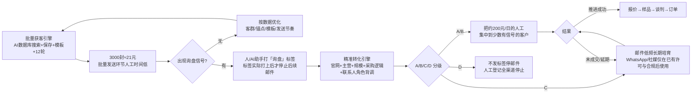

# 🧭 获客完整流程·逻辑图（完整版）

> **读图顺序**：① 批量获客引擎（登录→客群→搜索→保存→模板→序列）低成本广撒网 → ② S12 激活边界 → ③ 收到询盘信号后，由人或 AI 助手立即打“询盘”标签停后续邮件 → ④ 精准转化引擎（背调→A/B/C/D 分级→多渠道长期跟进）。
> **真源**：状态机定义见 `../RULES.md`（S0-S12）；本文件=把 RULES 画成图，规则冲突时以 RULES 为准。

## 🎬 一句话主线

**广撒网批量触达 → 询盘信号 → 人/AI助手打标签停邮件 → 公司与联系人背调 → A/B/C/D 分级 → 邮件为主、多渠道合规长期跟进 → 报价/样品/谈判；优质询盘再反哺客群和锚点扩量**

## 🌳 主逻辑图（Mermaid · 完整）

```mermaid
flowchart TD
    subgraph ENTRY["① 入口总线（每次会话必走）"]
        START([新会话 / 新产品]) --> ONB["onboard_check.py<br/>环境+文档引导"]
        ONB --> CL{"check_login.py<br/>token 有效?"}
        CL -- "无/失效" --> TK["引导用户按官方教程取 token<br/>（localStorage accesstoken）"] --> CL
        CL -- "有效（org 自动提取）" --> GC{"gate_check.sh 闸门"}
        GC -- "未通过" --> EB["⛔ ERROR_BLOCKED<br/>只读检查·禁止一切写操作"]
        GC -- "通过" --> S0
    end

    S0["S0 INPUT_GATE ★Gate0<br/>必填：昵称 + 基础产品信息<br/>（产品名/用途/行业/目标市场/卖点）<br/>缺一→询问，不猜不代填"]
    S0 --> S1{"S1 PATH_PENDING<br/>有精准客户网址?"}

    subgraph PATHA["② A 快速路径（有精准网址：老客户/询盘方网址）"]
        A1["网址搜相似<br/>refine/company-list（keyword=网址）<br/>确认：是客户方非自己·相关产品·非4区"]
    end

    subgraph PATHB["② B 标准路径（无网址）"]
        S2["S2 SEGMENT_PENDING<br/>推演客群默认4个（可 4→8）<br/>每客群：精准潜在客户=是/否/条件成立<br/>+周期/询盘速度/量级/邮箱/竞争度+推荐"]
        S2 --> S2C{"用户确认客群"}
        S2C -- "要更多" --> S2G["segment-generate 扩到8个"] --> S2
        S2C -- "确认" --> S2R["对抗审查①客群分析<br/>（空白子代理·五维有据·搜索词地道）"]
        S2R -- "整改P0/P1" --> S2
        S2R -- "放行" --> S3
        S3["S3 SEED_PENDING ★AI数据库搜索链<br/>①query_en搜第一页（含id）<br/>②代表买家id→base-info取真实域名<br/>③域名作keyword扩量（禁similar-list）<br/>用户确认锚点后进入S4审计，S5/S6负责保存"]
        S3 --> A1
    end

    S1 -- "有精准网址 → 快速路径A" --> A1
    S1 -- "无 → 标准路径B" --> S2

    subgraph BUILD["③ S4-S11 建成主线（产品→序列创建完成）"]
        A1 --> S4["S4 AUDIT_RUNNING 只读审计<br/>扩量结果排除CN/TW/HK/MO<br/>≥70%名单筛选边界：50页跳→三页平均→<br/>逐页→跌破往前（不是购买概率）"]
        S4 --> S5["S5 SAVE_PENDING<br/>展示：临界页/N/标签/排除4区(CN,TW,HK,MO)/<br/>contactMaxCount 3→6→9/点数/防重查重"]
        S5 --> S5C{"用户确认保存<br/>+ approval_id + 对抗审查②种子"}
        S5C -- "否/变化" --> S4
        S5C -- "确认" --> S6["S6 SAVE_RUNNING<br/>save_first_n --approval（front+exclude4区+max3）<br/>backend-task-status 等 finished<br/>→ verify_exclude 抽验4区 → 标签对账<br/>（防重看 contactSaveCount，非companySaveCount）"]
        S6 -- "异常/对账不符" --> EB
        S6 -- "finished+排除验证+标签对账通过" --> S7["S7 TEMPLATE_PENDING<br/>本地草稿：展示3-8个跨轮模板<br/>（render_preview 渲染收件人视图+理由）"]
        S7 --> S7C{"用户确认模板<br/>+ approval_id + 对抗审查③模板"}
        S7C -- "否" --> S7
        S7C -- "确认" --> S8["S8 TEMPLATE_BUILD<br/>gen_templates 批量建（分组 语言-产品）<br/>断言：id=24hex·变量code样式·标题纯文案<br/>·跨轮差异 Jaccard≤0.70（check_template_diff）"]
        S8 -- "断言失败" --> S7
        S8 -- "全部断言通过" --> S9["S9 SEQUENCE_PENDING<br/>12步：30分/5/15/30天·时区按语言市场<br/>（resolve_schedule 运行时解析，禁硬编码）<br/>单日30000/单家5·notSentTags=询盘+不发（按名解析）<br/>+ 对抗审查④序列配置"]
        S9 --> S9A["S9a 查询账号固定标签<br/>询盘/不发：存在复用id·不存在才建<br/>记录id(名称)"]
        S9A --> S9C{"用户确认建序列<br/>+ approval_id"}
        S9C -- "确认" --> S9B["建序列（保持 inactive）<br/>verify_sequence 12步硬断言<br/>重建铁律：先生成新→改步骤引用→再删旧"]
        S9B -- "异常" --> EB
        S9B -- "verify_sequence通过" --> S10{"S10 CONTACT_PENDING<br/>保存finished + 标签联系人>0 +<br/>序列inactive + 人数对账 + 用户确认?"}
        S10 -- "任一不满足" --> EB
        S10 -- "全满足" --> S10B["contact-add（views:[]）<br/>ops-log 登记流水"]
        S10B --> S11["S11 READY_INACTIVE ★建成<br/>输出完整流程/参数/数量/映射<br/>→ 不激活，等用户指令"]
    end

    S11 --> S12{"S12<br/>用户明确说<br/>'确认激活/激活序列<名称>'?"}
    S12 -- "否（默认）" --> WAIT["保持 inactive 待确认<br/>平台负责发送技术；运营方仍核验<br/>市场规则/名单/主体/退订/拒收"]
    S12 -- "是（唯一入口）" --> ACT["sequence-active 激活<br/>→ 12轮自动发信"]

    subgraph INQ["⑤ 精准转化引擎（询盘后：背调·分级·多渠道长期跟进）"]
        ACT --> REP{"收到回复/询盘信号?"}
        REP -- "否" --> STAT["继续广撒网统计<br/>更新模板效果/退信/回复率"]
        REP -- "是" --> Q1["Q1 人/AI助手立即打固定标签「询盘」<br/>→ 核对标签实际生效后才停后续邮件<br/>拒绝/退订→「不发」+人工登记全渠道停止"]
        Q1 --> Q2["Q2 登记 inquiries.tsv<br/>来源/公司/联系人/域名/国家/<br/>触发模板/轮次/回复原文/下一步"]
        Q2 --> Q3["Q3 ★公司与联系人背调<br/>官网/主营/规模/市场/采购逻辑/<br/>联系人角色/历史线索/公开商务渠道"]
        Q3 --> QL{"Q4 意向分级<br/>询盘≠订单，可能只是问价/比价"}
        QL -- "A 高意向" --> QA["规格/数量/时间明确<br/>快速定制回复+报价/样品<br/>预约电话或视频会议"]
        QL -- "B 中意向" --> QB["公司匹配但需求模糊<br/>精选2-3款+追问用途/数量/市场<br/>2-3天后跟进"]
        QL -- "C 远期/低意向" --> QC["暂无预算/项目延期/保持联系<br/>进入长期培育<br/>3-4周低频新品/案例/行业信息"]
        QL -- "D 无效/拒绝" --> QD["打「不发」标签停邮件<br/>人工登记并停止WhatsApp/社媒/电话"]
        QA --> QM["Q5 多渠道精准跟进<br/>邮件=正式资料/报价<br/>WhatsApp=已有明确许可后使用<br/>LinkedIn/商务社媒=公开职业身份<br/>电话=先查市场规则/拒呼记录/身份披露"]
        QB --> QM
        QC --> QM
        QM --> QANCHOR{"询盘方是优质买家锚点?<br/>目标客户线·非4区·邮箱可达"}
        QANCHOR -- "是" --> SEED["询盘网址回流 S1-A<br/>用同画像扩量，优化客群/模板"]
        QANCHOR -- "否/继续培育" --> STAT
        QD --> STAT
        STAT --> TPL{"回复率/询盘质量差?"}
        TPL -- "是" --> S2
        TPL -- "否" --> REP
        SEED --> A1
    end
```

## 💰 双引擎成本与分工（Mermaid）

> **成本口径**：用户提供的运营估算——1000 封约 7 元、3000 封约 21 元、单人最低日人工约 200 元。只用于比较直接获客成本，不承诺询盘或成交。

**成本判断**：3000 封的直接发送成本约 21 元（用户运营估算）；获得 A/B 级有效询盘说明低成本筛选出了值得投入人工的信号，但**询盘本身没有收入，不能证明已经回本**。是否覆盖成本要看后续成交毛利与完整运营成本。

## 📋 节点速查（S0-S12 + 询盘 Q1-Q5）

| 节点 | 名称 | 关键动作 | 确认/凭证 |
|------|------|---------|----------|
| S0 | INPUT_GATE | token+昵称+产品信息 | Gate0 必填 |
| S1 | PATH_PENDING | 有网址→A；无→B | 路径判定 |
| S2 | SEGMENT_PENDING | 推演4客群+五维+推荐 | 用户确认+审查① |
| S3 | SEED_PENDING | query_en搜第一页→id取域名→域名keyword扩量 | 用户确认+审查② |
| S4 | AUDIT_RUNNING | 70%临界（50页跳/三页平均/逐页/跌破往前） | 只读可自由执行 |
| S5 | SAVE_PENDING | 临界N/排除4区/max3/防重 | 用户确认+approval |
| S6 | SAVE_RUNNING | front保存→finished→verify_exclude→对账 | ops-log 流水 |
| S7 | TEMPLATE_PENDING | 草稿+渲染预览3-8个 | 用户确认+approval |
| S8 | TEMPLATE_BUILD | 批量建+断言（差异≤0.70） | 失败回 S7 |
| S9/S9a | SEQUENCE_PENDING | 账号固定标签询盘/不发存在即复用→12步+时区+30000/5 | 用户确认+approval+审查④ |
| S10 | CONTACT_PENDING | 时序守卫+人数对账→contact-add | 用户确认 |
| S11 | READY_INACTIVE | 输出全流程，**建成** | 不激活 |
| S12 | ACTIVE | 仅"确认激活"才激活 | 明确指令 |
| Q1 | 停发打标 | 人或AI助手立即打“询盘”；拒绝打“不发” | 标签实际生效才停邮件 |
| Q2 | 询盘登记 | 来源/公司/联系人/域名/模板/轮次/回复原文/下一步 | append |
| Q3 | 背调 | 官网/主营/规模/市场/采购逻辑/角色/公开商务渠道 | 回写询盘档案 |
| Q4 | A/B/C/D分级 | A/B人工重点跟进；C长期培育；D停止 | 询盘≠订单 |
| Q5 | 多渠道精准跟进 | 邮件主渠道；WhatsApp/社媒/电话需许可与市场合规 | 优质锚回流 S1-A |

## 🔍 询盘网址深挖（Q3 展开说明）

1. **取网址**：询盘邮件发件域名（@后缀）或签名档官网链接 = 询盘网址。
2. **深挖四路**：
   - 官网直接读：产品线/目标客群/规模线索（团队页/案例/新闻）；
   - `tools/audit_company.py`（只读）：AI 语义审计该公司画像；
   - 来发信库内查：该公司是否已保存/在哪个客群标签下（衔接 Q5 判锚点）；
   - 公开背景：搜索引擎补公司规模/口碑/采购角色。
3. **产出四件**：采购匹配度（会不会买我产品）、角色（决策/采购/终端）、回复要点（引用对方业务细节的钩子）、意向分级 level。
4. **铁律**：人或 AI 助手发现回复后，须**立即打“询盘”标签**——只有标签实际打上后，notSentTags 才会停止后续邮件；系统不会自动识别回复并打标签。深挖结论回写 inquiries.tsv（state/level/next）。
5. **回流**：优质询盘方网址 = 最佳精准种子 → 快速路径A → 相似客户再开新序列（闭环越滚越大）。

## 🔀 回退分支（据结果判断）

| 症状 | 处置 |
|------|------|
| 保存邮箱数=0/极少 | contactMaxCount 升 3→6→9（阶梯，仍少=换措施） |
| 种子不精准/混杂 | 换种子（更专的买家画像锚；S3 重挑） |
| 临界页无"跌破"（全程高） | 保存全量或降标准复核 |
| 查询接口间歇空 | 退避重试 + 改用稳定接口 backend-task-status |
| 模板差异≥30%不可度量 | 正文跨轮差异化，check_template_diff 逐模板取真 html 复测 |
| 保存后4区混入 | verify_exclude 复核（total截断≠无效，看列表内容） |
| token 中途失效 | 停一切写操作→重取→check_login 复验→**从当前节点续跑**（勿从S0重跑） |
| 对抗审查出 P0 | 操作不得执行/须回滚，整改后重审 |
| 同批已保存过 | 防重查重命中 → 不重存（省点数） |

## 🛠 每步工具/接口

- 入口：`onboard_check.py` → `check_login.py`（第一步）→ `gate_check.sh`（闸门）→ `flow_orchestrator.py`（向导 S0-S12）
- A①/B③ 搜相似: `refine/company-list`；S2 客群: `inference-segment-generate/list`
- S4 临界: `audit_company.py` + AI 反思（specs/threshold-method）
- S5/S6 保存: `save_first_n.py --approval`（front+exclude4区+max3）→ `wait_save_done.py` → `verify_exclude.py`
- S7/S8 模板: `gen_templates.py --preview` → `--approval` 建批 → `check_template_diff.py`（Jaccard≤0.70）→ 重建用 `rebuild_templates.py`（顺序铁律）
- S9 序列: `build_sequence.py`（12步 30分/5/15/30天；`resolve_schedule.py --tz` 运行时；notSentTags 按名解析 询盘/不发）→ `verify_sequence.py`
- S10: `contact_add.py`（views:[]）+ 本地 ops-log 流水
- 激活后: 后台报告拉取（模板效果）→ 本地 inquiries.tsv（询盘闭环）
- 全程: `check_rules.sh`（自查）；审批 `approval.py`（`.local/approvals.tsv`）；对抗审查 → 本地审查记录（不入 Git）
